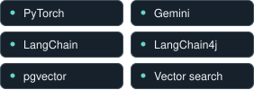
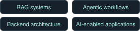

## Software Engineer · Applied AI

Building AI-enabled products and backend systems.

 
Lugano, Switzerland 
BSc in Informatics · Pursuing an MSc in Artificial Intelligence Università della Svizzera italiana (USI)

 

## What I build

I build **end-to-end software systems**, from backend architecture and data models to APIs, frontend integration, and deployment. My focus is the intersection of software engineering and modern AI: turning AI capabilities into useful, maintainable products.

> **Beyond the first demo** 
> Authentication, testing, failure paths, and reliability are part of the engineering work.

#### `01` &nbsp; Applied AI

RAG, information retrieval, and tool-using agents that solve product and operational problems.

#### `02` &nbsp; Backend systems

Clear APIs, deliberate data modelling, and dependable integrations.

#### `03` &nbsp; Product engineering

Connecting the backend, interface, and AI layer into a coherent application.

 

## Technical toolkit

**Languages**

Python · Java · TypeScript / JavaScript · C++ · C · SQL

**Backend & data**

FastAPI · Spring Boot · PostgreSQL · Supabase · MongoDB · REST APIs

**Frontend**

Next.js · React · Vue

**AI / ML & retrieval**

RAG · Tool-using agents · Machine learning fundamentals

**Tools & deployment**

Docker · Git / GitHub · Linux · Vercel

 

## Engineering experience

### AI Integration Engineer

**Ex Machina AI.Lab** &nbsp; / &nbsp; Lugano, Switzerland 
Previous role

> Built AI-enabled software and backend integrations, with a focus on workflow automation and AI orchestration.

- **Spring Boot + LangChain4j** — tool-driven workflows and human-in-the-loop decision flows.
- **Gemini** — chatbot systems and backend integration work.

 

## On the workbench

Currently building AI-enabled applications and backend-heavy product ideas, exploring document ingestion, semantic chunking, and the architecture needed to integrate AI into real software.

<strong>More of my engineering background</strong>

My personal and academic work spans AI study tools, career tools, developer analytics, and Git repository mining, alongside algorithms, information retrieval, and systems programming.

 

<!-- Add Selected Work here when projects are public and ready to share.
     Use verified repository links and concrete engineering descriptions. -->

## GitHub activity

More project work will be published here over time.

 

---

### Let's connect

Interested in software engineering roles building 
AI-enabled products and backend systems.

